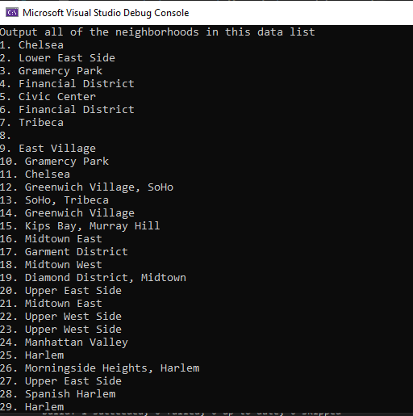

# Lab09-LINQ

## Description
This is a C# console application that takes in a JSON file of different NY neighborhoods, 
and then filters the results to remove empty names and duplicates. 
Displays filtered results to the console.

## How do you run the program?
1. Clone repo to your device.
2. Open the solution file Lab09-LINQ.sln in Visual Studio.
3. To run the app, go to Debug > Start Without Debugging (or press ctrl+F5).

## Visuals
Question 01

